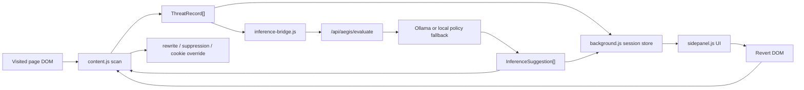

# AEGIS
## Technical Brief for IT Developers

Datum: 28. 4. 2026  
Repo root: [E:\guard](</E:/guard>)  
Produkční doména: `https://aegis.d-international.eu`

## 1. Co AEGIS technicky je
AEGIS je local-first intervention stack pro browser.

Prakticky kombinuje:
- Next.js produktový web
- browser extension runtime
- lokální inference bridge
- auditovatelný zásahový model

Nejde jen o landing page.  
Aktuální MVP už obsahuje první uzavřený technický loop:

`scan -> classify -> rewrite / suppress -> audit -> revert`

## 2. Hlavní systémové vrstvy

### Web
- framework: `Next.js 16`
- language: `TypeScript`
- UI: `Once UI` + custom shell
- produkční surface:
  - `/`
  - `/ai-guard`
  - `/ai-guard/philosophy`
  - `/ai-guard/detection`
  - `/ai-guard/defense`
  - `/ai-guard/build`
  - `/ai-guard/results`

### Extension
Hlavní složka:
- [E:\guard\extension](</E:/guard/extension>)

Klíčové soubory:
- [E:\guard\extension\manifest.json](</E:/guard/extension/manifest.json>)
- [E:\guard\extension\content.js](</E:/guard/extension/content.js>)
- [E:\guard\extension\background.js](</E:/guard/extension/background.js>)
- [E:\guard\extension\sidepanel.html](</E:/guard/extension/sidepanel.html>)
- [E:\guard\extension\sidepanel.js](</E:/guard/extension/sidepanel.js>)
- [E:\guard\extension\inference-bridge.js](</E:/guard/extension/inference-bridge.js>)

### Shared contracts
- [E:\guard\src\lib\ai-guard\contracts.ts](</E:/guard/src/lib/ai-guard/contracts.ts>)

### Local inference endpoint
- [E:\guard\app\api\aegis\evaluate\route.ts](</E:/guard/app/api/aegis/evaluate/route.ts>)

## 3. Architektonický přehled



## 4. Runtime flow detail

### 4.1 Scan
`content.js` prochází textové prvky a hledá patterny:
- `urgency`
- `scarcity`
- `social_proof`

Výstup je `ThreatRecord[]` s poli:
- `id`
- `type`
- `text`
- `source`
- `confidence`
- `severity`
- `selector`

### 4.2 Background orchestration
`background.js`:
- ukládá threats per-tab
- drží evaluation výsledky per-tab
- rozesílá update do UI
- řeší cleanup po zavření tabu

### 4.3 Sidepanel
`sidepanel.js` zobrazuje:
- current threats
- inference result
- audit trail
- manual scan
- revert DOM

### 4.4 Inference
Bridge je volitelný. Pokud je zapnutý:
- content/background pošlou data do `/api/aegis/evaluate`
- route se pokusí použít Ollama
- pokud Ollama není dostupná, route vrátí local policy fallback

### 4.5 Intervention
Aktuální zásahy:
- rewrite textu
- suppression urgency stylů
- cookie-banner normalization
- revert zásahu

## 5. Kontrakt inference vrstvy
Z [E:\guard\src\lib\ai-guard\contracts.ts](</E:/guard/src/lib/ai-guard/contracts.ts>):

Klíčové typy:
- `ThreatRecord`
- `InferenceEvaluationRequest`
- `InferenceEvaluationResponse`
- `InferenceSuggestion`
- `AuditTrailEntry`

Podporované intervention modes:
- `flag`
- `rewrite`
- `block`

Aktuálně produkčně použité:
- `rewrite`
- částečně `flag`

`block` je zatím spíš připravená kontraktová cesta než uzavřený produktový režim.

## 6. Co umí content layer dnes

### Rewrite
- originální text se uloží do `data-*`
- element dostane metadata o zásahu
- tlakové copy se přepíše do neutrálnějšího jazyka

### Suppression
- urgency patterny dostávají jemný visual suppression pass
- tlumí se glow, animace a tlakový styling
- layout se nerozbíjí

### Cookie override
- copy typu `accept all / reject / settings` se normalizuje
- systém nic automaticky neodklikává
- upravuje se srozumitelnost a vizuální tlak

### Revert
- sidepanel umí přes `Revert DOM` vrátit zásahy zpět
- reverted element se do reloadu znovu nezasáhne

## 7. Inference endpoint chování
Soubor:
- [E:\guard\app\api\aegis\evaluate\route.ts](</E:/guard/app/api/aegis/evaluate/route.ts>)

Režimy:
- `provider: ollama`
- `provider: custom`
- `provider: disabled`

Fail-soft vlastnost:
- když Ollama vrátí výsledek, použije se AI suggestion flow
- když Ollama neběží, systém nespadne
- vrací local policy recommendation

To je důležité pro demo, development i budoucí on-prem variantu.

## 8. Co je dnes hotové

### Web / product shell
- SEO, favicons, OG assets
- AEGIS branding
- embedded `Expected Results`
- app-like AEGIS UI surface

### Extension / runtime
- MV3 scaffold
- typed contracts
- background/content/sidepanel messaging
- manual scan
- local inference endpoint
- rewrite / suppression / cookie normalization
- revert DOM

## 9. Co ještě není uzavřené
Podle aktuálního [E:\guard\TODO.md](</E:/guard/TODO.md:1>):

- unpacked Chrome flow needs end-to-end verification
- persistent live scan state
- real threat feed místo části simulace
- explicitnější audit trail export
- finální inference strategy decision
- dataset manipulačních patternů v češtině

## 10. Spuštění

### Web
```bash
npm run dev
```

### Type safety
```bash
npm run typecheck:web
npm run typecheck:extension
npm run typecheck
```

### Production build
```bash
npm run build
```

### Extension
1. otevřít `chrome://extensions`
2. zapnout `Developer mode`
3. kliknout `Load unpacked`
4. vybrat [E:\guard\extension](</E:/guard/extension>)

## 11. Doporučený technický demo flow
1. otevřít `https://aegis.d-international.eu/ai-guard`
2. stručně vysvětlit architekturu
3. otevřít extension sidepanel
4. pustit manual scan
5. ukázat threat feed
6. ukázat rewrite
7. ukázat suppression
8. ukázat inference log
9. ukázat `Revert DOM`

## 12. Co tvrdit poctivě
Je v pořádku říct:
- "Máme funkční typed MVP flow."
- "Máme první reálné DOM zásahy."
- "Inference bridge už běží proti lokálnímu endpointu."
- "Fail-soft fallback drží demo i bez aktivního modelu."

Není dobré říct:
- "Máme hotový enterprise-ready browser security produkt."
- "Máme validovaný model precision/recall."
- "Máme hotovou production distribuci."

## 13. Proč je to technicky zajímavé
AEGIS je zajímavý jako produktový pattern, protože spojuje:
- browser extension jako intervention runtime
- typed contracts mezi webem a extension
- local-first inference
- auditovatelný zásahový model
- vratitelnost zásahů

To znamená, že další vývoj nejde do prázdna.  
Technická osa už existuje a dá se na ní stavět konzistentně.

## 14. Další doporučené technické kroky
Nejlepší pořadí:
- ověřit unpacked extension flow end-to-end
- dopojit real threat feed
- přidat audit trail export
- rozšířit intervention modes o řízený `block`
- rozhodnout finální Ollama / custom runtime policy
- začít sbírat pattern dataset

## 15. Jednověté technické shrnutí
AEGIS je typed local-first browser intervention stack, který umí detekovat manipulační patterny, bezpečně zasahovat do DOMu a připravuje půdu pro lokální LLM-assisted cognitive defense.
